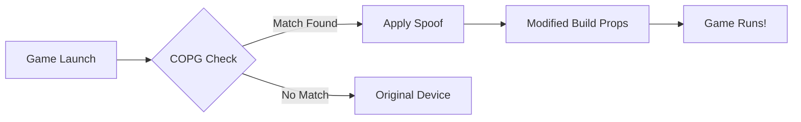

<div align="center">
  

</div>
<h1 align="center">🎮 COPG - Ultimate Device Spoofer for Android Games & Apps</h1>

[](https://github.com/topjohnwu/Magisk)
[](https://www.android.com/)
[](LICENSE)
[](https://github.com/AlirezaParsi/COPG/releases)


**The most advanced device spoofer for Android gaming - bypass restrictions and play any game on any device!**

## 🌟 COPG - Ultimate Device Spoofer for Games & Apps 🌟
**Unlock the full potential of your games and apps with COPG! Spoof your device to enjoy premium features, max performance, and exclusive benefits. 🚀**
### 🎮 Maximize Your Gaming Experience
- Call of Duty Mobile: 120 FPS (BR/MT)
- PUBG/BGMI: 120 FPS + Haptic Feedback
- Delta Force: 120 FPS/HD Graphics
- Mobile Legends: Ultra 120 FPS
- Freefire / Freefire max 120 FPS
- Fortnite 120 FPS
- +60 games supported!
### 📱 Exclusive App Enhancements
Google Photos: Unlimited backup + AI generator
TikTok: Stream in stunning 1080p
### 🔧 Flexible & Future-Proof
Add new devices or games anytime
Beautiful WebUI to manage your spoofed apps
💡 Why Choose COPG?
Transform your device into a powerhouse for gaming and apps. Easy to use, fully customizable, and packed with features!

## 🛠️ Installation Made Simple

### 📋 Requirements
- Rooted Android device (9.0+)
- One of these root solutions:
  -  with [Zygisk Next](https://github.com/Dr-TSNG/ZygiskNext)/[Rezygisk](https://github.com/PerformanC/ReZygisk)
  -  with [Zygisk Next](https://github.com/Dr-TSNG/ZygiskNext)/[Rezygisk](https://github.com/PerformanC/ReZygisk)
  -  with [Zygisk Next](https://github.com/Dr-TSNG/ZygiskNext)/[Rezygisk](https://github.com/PerformanC/ReZygisk)
## 📃 Note
- Standard/Native Zygisk isn't supported because its not safe.
- WebUI-X is recommended.

## Download Module
> [!TIP]
> - You can download the module from:\
[](https://mmrl.dev/repository/zguectZGR/COPG)
> - Or from [Releases](https://github.com/AlirezaParsi/COPG/releases) section.

### ⚙️ Installation Steps
1. Download the latest `COPG.zip` from [Releases](https://github.com/AlirezaParsi/COPG/releases)
2. Install via your root manager:
   - Magisk: Modules → Install from storage → Select ZIP
   - KernelSU: Modules → Install → Select ZIP
   - APatch: Modules → Install → Select ZIP
3. Reboot your device
4. Verify installation in your root manager (look for "✨ COPG spoof ✨")

## 🧩 Module Architecture

### Customizing Spoof Profiles
Edit `/data/adb/modules/COPG/config.json` with this format:

```json
{
  "PACKAGES_REDMAGIC9": [
    "com.mobilelegends.mi",
    "com.supercell.brawlstars"
  ],
  "PACKAGES_REDMAGIC9_DEVICE": {
    "BRAND": "ZTE",
    "MODEL": "NX769J",
    "FINGERPRINT": "ZTE/NX769J...",
    "CPUINFO": "Qualcomm Snapdragon 8 Gen 3"
  }
}
```
## ❓ FAQ
<details> <summary>📌 Will this get me banned?</summary> While COPG is designed to be undetectable, I cannot guarantee safety. Use at your own risk. </details><details> <summary>⚡ Does it affect performance?</summary> Minimal impact! My optimized code adds just ~1ms to launch time. </details>

## Activity


## 🖼 Screenshots 

### 🌐 WebUI Interface
<div align="center">
  <table>
    <tr>
      <td align="center">
        
        <br><em>Settings Panel</em>
      </td>
      <td align="center">
        
        <br><em>Settings Panel</em>
      </td>
    </tr>
    <tr>
      <td align="center">
        
        <br><em>Device Profiles</em>
      </td>
      <td align="center">
        
        <br><em>Game list</em>
      </td>
    </tr>
  </table>
</div>

### 🎮 Game Examples
<div align="center">
  
  
  
  
</div>

---
- [](https://t.me/COPG_module)
- [](https://t.me/TheAOSP)
---

<div align="center"> Made with ❤️ by Alireza Parsi | © 2025 COPG Project </div> 
